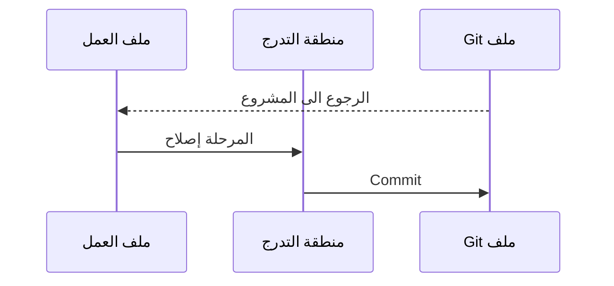
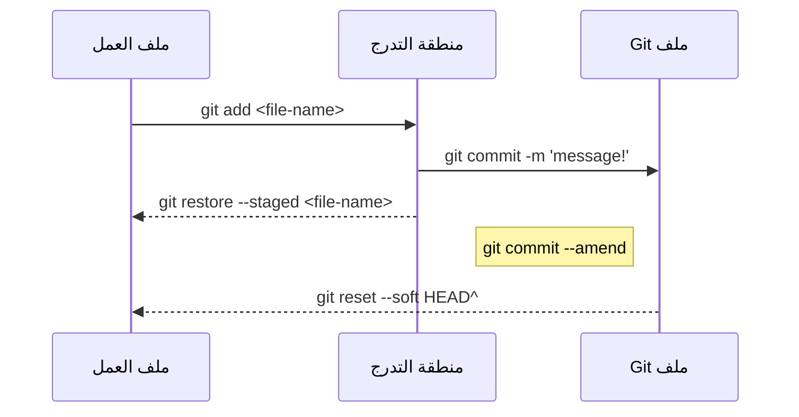

# Git

- ماهو Git؟

	- حالات الإستخدام

- كيف يعمل Git؟

- الحالات الثلاث

- تثبيت Git

- إعداد Git

- إنشاء مستودع Repository

  	- مثال
  
- إنشاء فرع branch

  	- مثال

  

# GitHub

- ماهو GitHub؟

- الفرق بين Git و GitHub

- مميزات GitHub

- إنشاء مستودع Repository
  
- ماهو remote؟

- إنشاء فرع (Branch)

- إنشاء طلب تعديل (Pull Request)

- دمج الطلب (merge)

## ماهو Git

Git برنامج مجاني مفتوح المصدر ويدعى نظام النحكم في الإصدار الموزع (عكس المركزية) للتعامل
مع المشاريع الصغيرة والكبيرة بسهولة وسرعة.


### حالات الإستخدام

يستخدم في مشاركة المشاريع بين المبرمجين.
يساعد في إنشاء مراحل تطوير المشروع بالتاريخ وإمكانية الرجوع إليها.
تطوير عدة خصائص في المشروع في نفس الوقت.

## كيف يعمل Git

يقوم Git إنشاء نسخة للملفات التي تم تغيرها فيما يشبة "الصورة" أو مقتطف عن التغييرات وتسمى `commit` داخل ملف مخفي `/git.` يدعى Git repository اي المستودع ومع مرور الزمن وتراكم commits يتم إنشاء سجل `Log ` هذا يعني إذا قمت بحذف الملف سيحذف سجل التغييرات المشروع، ويوجد مراحل يمر بها الملفات وتسمى الحالات الثلاث.

## الحالات الثلاث

إن جميع الملفات في المستودع تمر بثلاث الحالات أساسية وفي الاغلب تتكرر العملة وهي دورية:

- ملف العمل:  وهي مرحلة الابتدائية لإنشاء الملفات أو تغييره دون تتبع.(untrack)

- منطقة التدرج: يعني أن الملف تم تغييرة والاشارة اليه إلى الانتقال "commit"

- ملف Git: المرحلة النهائية وهي حفظ الملفات وعمل نسخة والرجوع للمرحلة الابتدائية.




## تثبيت Git


https://git-scm.com/download


## إعداد Git

أعداد الإسم واللقب مع البريد الالكتروني هذه الاوامر مهم للتعريف بك في المشروع

```bash
git config --global user.name "FirstName LastName"
git config --global user.email "email@example.com"
```

## إنشاء مستودع Repository

أولا إنشاء ملف وتهيئة المستودع ثم الدخول للملف عن طريق commend-line

```bash
git init my-project    # إنشاء الملف
cd my-project    
cd <name-repo>
git init
ls -a 
. .. .git/

```

أما إذا كان المشروع موجود من قبل نقوم بستنساخ المستودع (cloning).

```bash
git clone http://github.com/user-name/repo.git
```


عند تهيئة المشروع نلاحظ تغيير في الاعلى بظهور كلمة (master)...


## مثال

- إنشاء مستودع 

  - [ ] إنشاء ملفات 

  - [ ] تتبع الملفات 

  - [ ] حفظ التغييرات

    

### إنشاء ملف

````bash
touch <file-name>
````


 ### تتبع الملف

````bash
git add <file-name>
````


### حفظ التغييرات

````bash
git commit -m "Clear message & short!"
````

#### إظهار الحالة

###  سجل التغييرات


````bash
git log
````


## مخطط الاوامر

هذ الاوامر تعتبر متكررة ومع الوقت تصبح إعتيادية




## Git branch

هو مثل الورقة المسودة تجري فيه محاولة إضافة ميزة جديد أو اصلاح خطأ دون الخوف من تلف الملفات أو فقدان،ويتم إنشاء فرع يسمي master وهو الفرع الاساسي للمشروع(branch)


### مثال

 - إنشاء مميزة جديد
   - [ ] إنشاء فرع جديد
   
   - [ ] تغيير الملفات
   
   - [ ] دمج التغييرات
   
     

### إنشاء فرع جديد

```bash
git branch test # Create New branch
git checkout test # Switch to branch test
## or Create & switch
git checkout -b test
```


### تغيير الملفات

(كما في السابق)


### دمج التغييرات

````bash
git checkout master # Return to master branch
git merge test      # merge test into master
````


### مخطط الفرع (branch)

[](https://mermaid-js.github.io/mermaid-live-editor/#/edit/eyJjb2RlIjoiZ2l0R3JhcGg6XG5vcHRpb25zXG57XG4gICAgXCJub2RlU3BhY2luZ1wiOiAxMjAsXG4gICAgXCJub2RlUmFkaXVzXCI6IDEwXG59XG5lbmRcbmNvbW1pdFxuYnJhbmNoIHRlc3RcbmNoZWNrb3V0IHRlc3RcbmNvbW1pdFxuY29tbWl0XG5jaGVja291dCBtYXN0ZXJcbmNvbW1pdFxuY29tbWl0XG5tZXJnZSB0ZXN0XG5cblx0XHRcdFx0XHQiLCJtZXJtYWlkIjp7InRoZW1lIjoiZGVmYXVsdCJ9LCJ1cGRhdGVFZGl0b3IiOmZhbHNlfQ)

