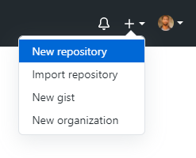
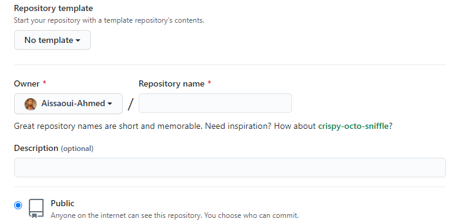
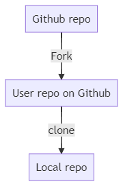
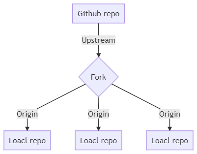

# GitHub

- ماهو GitHub؟
- لماذا GitHub؟
- الفرق بين Git و GitHub
- مميزات GitHub
- إنشاء مستودع Repository
- ماهو remote؟
- فرع (Branch)
- إنشاء طلب تعديل (Pull Request)
- دمج الطلب (merge)

## ماهو GitHub؟

هو منصة للمطوريين تستضيف المشاريع مفتوحة المصدر والاعمال يمكن بناء برامج وتحرير وتعديل وتسيير ...

تحتوي على أكثر من 50 مليون مبرمج.

## لماذا GitHub؟

فضاء لمشاركة و التقييم كود  (Source code)  

## الفرق بين Git و GitHub

|                               GitHub |                                    Git |
| -----------------------------------: | -------------------------------------: |
|                                 خدمة |                                 برنامج |
|                          إستضافة ويب |                       تنصيب في الحاسوب |
|                   مساحة رفع المستودع | اداة إدارة النسخ للتغييرات في المستودع |
| يوفر خدمات VSC وتسيير كود والكثير... |                         VSC وتسيير كود |

## مميزات GitHub

- الاستضافة المشاريع

- التعاون

- طلب تغيير (pull request)

- مراجعة أو تصحيح (review)

- اقتراح التغييرات (suggestion)

- تتبع المشاكل و القضايا (issue tracker)

## إنشاء مستودع Repository







## فرع (Branch)

الفرع (branch) هو ببساطة مؤشر التقدم عند (commit) اي أخر تغيير في فرعنا ما

مثال عندما تريد إضافة ميزة جديدة أو عمل تصحيح دون تغيير في master

## ماهو remote؟

لرفع محتوى مستودع يجب معرفة أين ستضعها لذا لدينا remote وهو رابط المستودع في GitHub يأتي على شكل:

`https://github.com/user-name/repo-name.git`

أو على شكل SSH

`ssh://git@github.com:user-name/repo-name.git`



Upstream على شكل:

<https://github.com/org/repo-name.git>

origin على شكل:

<https://github.com/your-name/same-repo-name.git>

### إضافة remote

```bash
git remote add <NAME> <GIT-URL>
git remote add origin https://github.com/user-name/repo-name.git
```

### تعديل remote

```bash
git remote set-url <NAME> <GIT-URL>
git remote set-url origin https://github.com/user-name/repo-name.git
```

### حذف remote

```bash
git remote remove <NAME> # OR rm
```

## إنشاء طلب تعديل (PR)

## دمج الطلب (merge)
